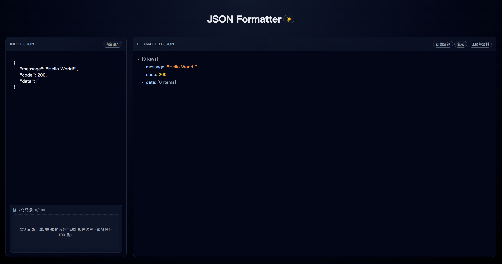

# JSON Formatter

一个本地运行的 JSON 格式化小工具：支持多层嵌套 JSON 解码，树形视图展示，高亮、复制、历史记录与暗/亮主题切换。

所有解析逻辑均在浏览器本地完成，不上传任何数据。



## 功能

- 自动格式化并高亮 JSON
- 自动尝试解码被多次 `JSON.stringify` / 转义的字符串
- 树形 JsonViewer：展开/折叠、显示元素/键数量、行级复制
- 顶部一键复制「美化 JSON」或「压缩 JSON」
- 本地最多保留 100 条格式化记录，可快速回填
- 暗色 / 亮色主题，默认跟随系统，可手动切换

## 开发

```bash
npm install
npm run dev
```

在浏览器中访问终端输出的本地地址（通常为 `http://localhost:5173/`）。

## 构建

```bash
npm run build
```

构建产物输出到 `dist` 目录，可用任意静态服务器托管。

## 技术栈

- React + TypeScript
- Vite
- 原生 CSS + CSS 变量（主题切换）
